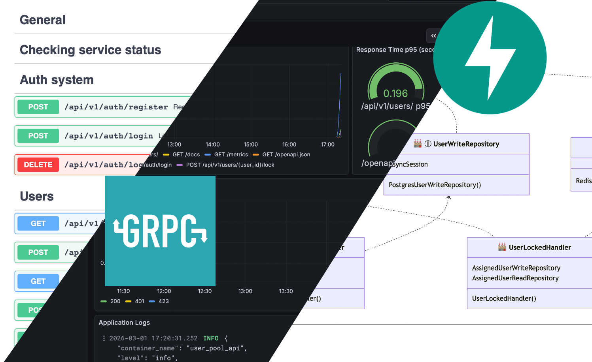

# User Pool service for e2e-tests

A data generation platform that simulates user context within a given resource.



Available paths: [Swagger](https://localhost/docs), [Grafana](https://localhost/grafana)

The application is built using a layered architecture. The service implements CRUD and integration with an external 
authentication microservice via gRPC. Kubernetes tests were also performed and dashboards were built.

## Launching the application


### 1. Set up environment variables

1. Create .env files `just env-create`
2. Set up environment variables for docker

###### Environment variables for docker dev mode (Example)

```
# ./env

DB_USER=my_user
DB_PASSWORD=my_pass
DB_NAME=user_pool

REDIS_PASSWORD=supersecret
```

3. Setting up environment variables for the application configuration
   - `./configs/config/config.yaml` 
   - `./configs/config/.env.dev`
   - `./configs/config/.env.test`


> For docker test mode, environment variables are taken from the same file as the application itself.


4. Integration with an external SSO service

#### Setting up a gRPC client:

4.1. Change the host and port information in `configs/config/.env.*`

4.2. If you want to run the project locally, you can run a [local SSO server](https://github.com/MaximGit1/go-sso). After installing, configuring, and launching the container, you need to create a network.

```shell
docker network create grpc_network
```

4.3. Copy the JWT public key file from the SSO application and specify the path in the config
4.4. Run API container (current repository)
4.5. Find out container names

```shell
docker ps
```

4.6. Connect containers to the shared network

```shell
docker network connect grpc_network auth-auth-1
docker network connect grpc_network user_pool_api
```
###### insert your container names

4.7. Restart containers

___

5. Create keys for nginx

```shell
openssl req -x509 -nodes -days 3650 -newkey rsa:2048 \                                                            
-keyout configs/nginx/certs/privkey.pem \
-out configs/nginx/certs/fullchain.pem \
-subj "/C=DE/ST=Hesse/L=Frankfurt/O=Dev/CN=localhost"
```

### 2. Run docker compose and run migrations (Dev mode)

```shell
just dev-up
```

Wait until the containers are ready to work and apply the migration (the first migration has already been created)

```shell
just migrate-up
```


### 3. Grafana settings

1. Go to [address](https://localhost/grafana)
2. Log in `admin: admin`
3. Create a new dashboard and import the json schema from `configs/grafana/dashboards/fastapi-dashboard.json`


## Application testing

Dependencies need to be installed

```shell
uv pip install --group test
```

### Running a Docker container for e2e tests

```shell
just test-up
```

> Only postgres and redis are running; ports are open

## Scripts

### View the dependency delivery schedule

1. Execute script

```shell
just plot
```

2. Copy the finished HTML page
3. Create an HTML file anywhere and paste the generated content

### Running locally outside a Docker container

```shell
PYTHONPATH=src uv run --env-file configs/config/.env.test src/user_pool/setup/main.py
```


___

## Controversial decisions and assumptions

> [!NOTE]
> This repository is experimental. I decided to bring the practice of creating methods and functions from Rust and Golang
> 
> Also, rethink some axioms with the goal of manual control, rather than having it happen magically
> 
> Some points were deliberately ignored, while others were simplified or, on the contrary, complicated!
> 
> This repository was created solely to make it easy to copy ready-made solutions from one project to another, without having to design the basic things, but simply adapting them to your needs

1. The base class for Value objects is completely unnecessary, and the `unfase` method seems like a rather controversial solution, but I decided to make it explicit
2. Config builder. I decided to separate environment variables into public `.yaml` and private `.env`. It was possible to use ready-made solutions.
3. Tests and infrastructure. The emphasis was on code and module interactions, not on tests or near-perfect configuration settings 
4. Sampling applies only to databases; gRPC and other components can be done similarly
